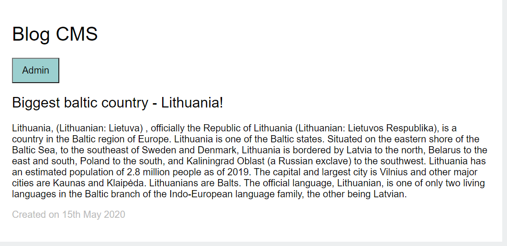
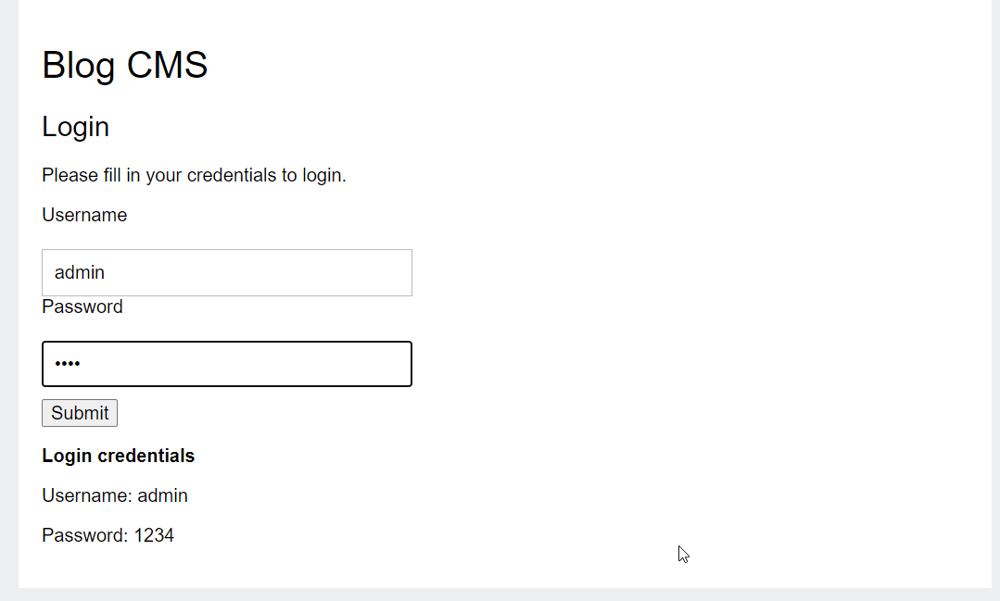
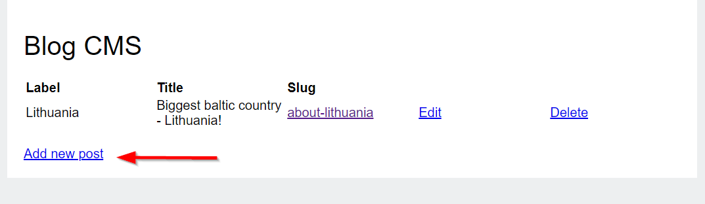
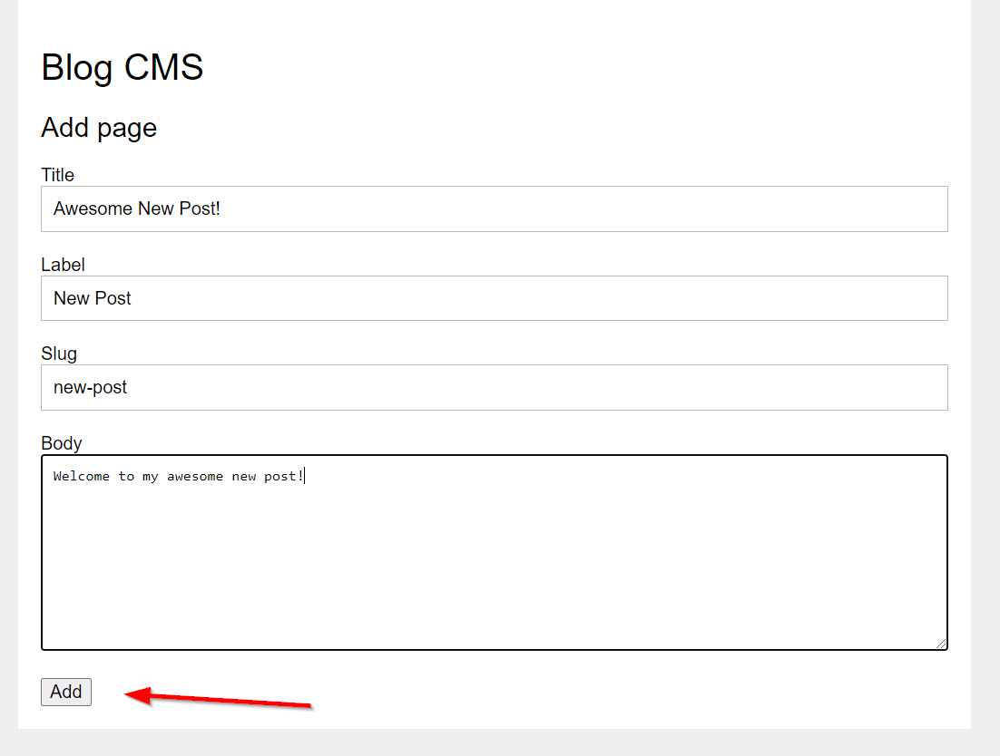
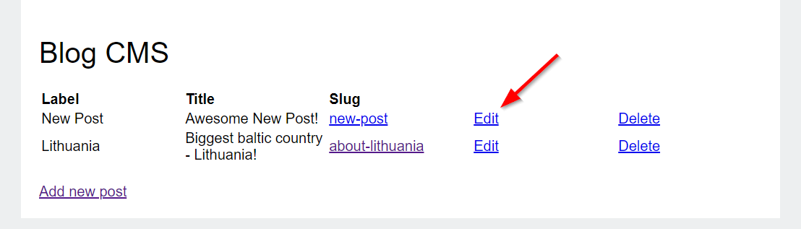
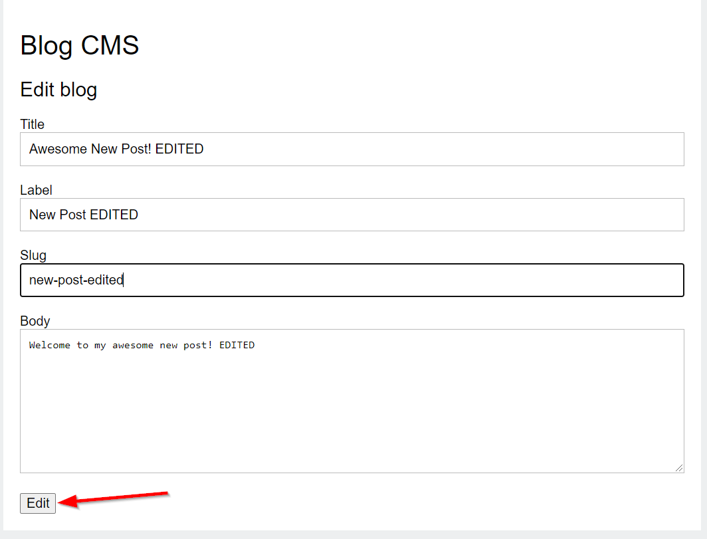
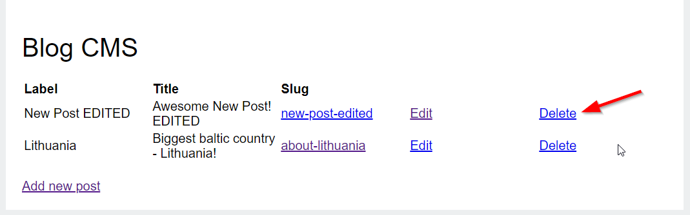

# Simple Blog posts CMS
Hi! This is my PHP Sprint 3 called Simple blog post CMS. Read description below.
## Simple blog post CMS features
- Create database and tables with data using CMS.sql file;
- Read blog posts;
- Possibility to log in as ***ADMIN*** with these credentials :

    > Username: admin
    > Password: 1234
- ADMIN DASHBOARD: 
    - ***Create*** new post,
    - ***Edit*** post,
    - ***Delete*** post.
## How to use CMS:
1. Open AMPPS Apache server;

2.  Open ***CMS.sql*** file in MySQL Workbench and create database/table;

3. Open PHP_Sprint_Three project and select blog post to read it;

4. Open Admin dashboard and login with credentials;

5. Click ***add new post*** to create new Blog post;

Fill information and click **Add**

6. Click ***Edit*** to Edit existing Blog post;

Change information and click **Edit**

7. Click ***Delete*** to Delete existing Blog post;

 ## Thank you!
